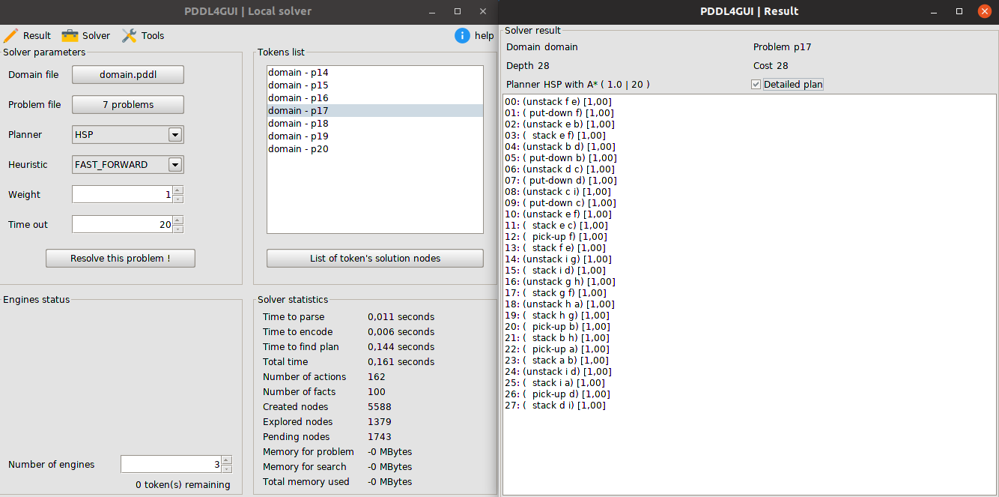
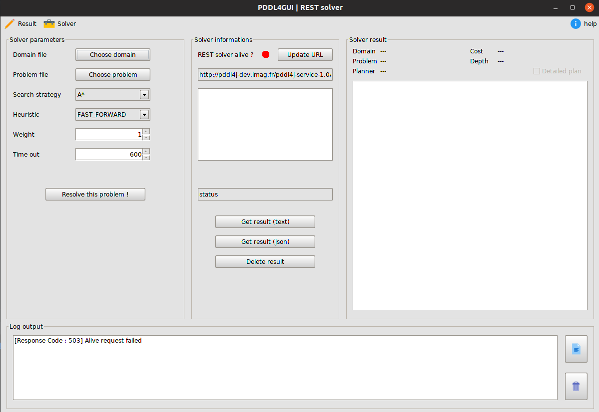

# Automated planning and scheduling whith PDDL4J and PDDL4GUI

### PDDL4J

PDDL4J is an open source library under LGPL license.

The purpose of PDDL4J is to facilitate the development of JAVA tools for
Automated Planning based on PDDL language (Planning Domain Description
Language). Automated planning and scheduling, in the relevant literature often
denoted as simply planning, is a branch of artificial intelligence that concerns
 the realization of strategies or action sequences, typically for execution by
intelligent agents, autonomous robots and unmanned vehicles.

The library contains:
  * A PDDL 3.1 parser and all the classes need to manipulate its
concepts. The parser can be configured to accept only specified requirements of
PDDL language.
  * A set of useful pre-processing mechanisms in order to instantiate and
simply operators into ground actions based on inertia properties.
  * A set of already implemented classical heuristics, e.g., h_ff, h_max, etc.
  * Several examples of planners using PDDL4J.

[PDDL4J on github](https://github.com/pellierd/pddl4j)

### PDDL4GUI

PDDL4GUI is a small application written in Java that provides a graphical interface to the PDDL4J library. PDDL4GUI offers:
  - A graphical interface for solving planning problems with the PDDL4J library.
  - A graphical interface for solving planning problems through PDDL4J webservice and RESTFull API.
  - Anytime behavior for compatible planners.
  - The integration of VAL (The plan validation system) which offers the possibility to test the validity of the plans provided by PDDL4J.

Features that will be integrated later:
  - A tool to visualize solution plans.
  - ...

#### Dependency

Java JDK 8 must be installed on the computer that will run PDDL4J:

**On windows**

Go to Oracle website and download the JDk corresponding to your computer architecture (x64 or x86): [Java](https://www.oracle.com/technetwork/java/javase/downloads/jdk8-downloads-2133151.html)

After the installation, you have to add java in the *PATH*.

**On Linux (Debian / Ubuntu)**

    sudo apt-get install openjdk-8-jdk
  
#### How to use the PDDL4GUI
Download or clone the repository.

With Gradle :

    # Build PDDL4GUI (compile, assemble, jar, checkstyle)
    ./gradlew build
    # Generate .jar file
    ./gradlew jar
    # Generate javadoc
    ./gradlew javadoc
    # Run PDDL4GUI (LOCAL)
    ./gradlew run -PArgs=-LOCAL
    # Run PDDL4GUI (REST)
    ./gradlew run -PArgs=-REST

On linux with *pddl4gui_xxx.sh* scripts, available at the root of the repository:

    ./pddl4gui_loc.sh  # Run PDDL4GUI (LOCAL)
    ./pddl4gui_rest.sh # Run PDDL4GUI (REST)

With java command lines:

    java -javaagent:pddl4gui-1.0.jar -server -Xms2048m -Xmx2048m -jar pddl4gui-1.0.jar -LOCAL
    java -javaagent:pddl4gui-1.0.jar -server -Xms2048m -Xmx2048m -jar pddl4gui-1.0.jar -REST

*Note: the libs and resources folders are needed because not integrated into the jar file.*
